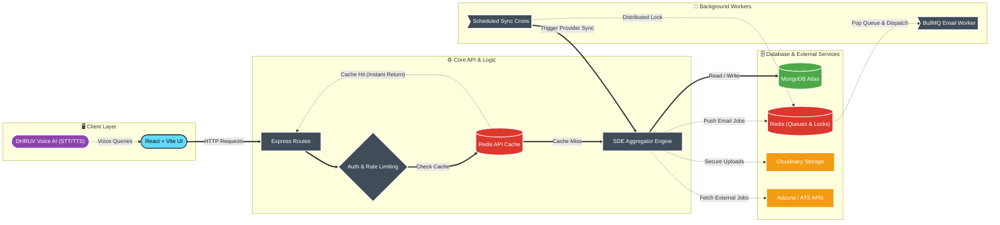

# SkillBridge 🚀

**Bridging talent and opportunity in one intelligent job portal.**

SkillBridge is an enterprise-grade full-stack job portal built for candidates, recruiters, and administrators to connect, apply, manage applications, and aggregate global career opportunities. Powered by a high-performance MERN architecture, Redis caching, AI-assisted career coaching, and automated multi-provider job aggregation.

---

## 🌟 Live Demo & Preview

- **Web App**: [https://job-portal-system-alpha.vercel.app](https://job-portal-system-alpha.vercel.app)
- **Backend API**: Hosted on Render with distributed cron execution and Mongo Atlas.

---

## 🚀 Key Highlights

- 🤖 **DHRUV AI Career Coach**: Voice-enabled AI assistant supporting hands-free Speech-to-Text (STT) and Text-to-Speech (TTS) voice readback for interactive career guidance, resume suggestions, and job matching.
- 🔄 **Single Data Engine (SDE) Sync**: Multi-provider live job aggregator (Adzuna API, Greenhouse, Lever ATS) featuring automated hash deduplication (`HashOptimizer`), domain signature verification (`SignatureVerifier`), and company lifecycle management (`LifecycleManager`).
- ⚡ **High-Performance Architecture**: Multi-level Redis caching, distributed cron locks (`SET NX EX`), and BullMQ background queues for zero-latency email dispatching.
- 🔒 **Enterprise Security**: Signed Cloudinary resume delivery, strict CORS controls, brute-force rate-limiting, and transparent Cookie Consent management.
- 🎨 **Modern Responsive UI**: Clean Tailwind CSS design system with custom dropdowns, glassmorphism advisory modals, and PWA capabilities.

---

## 🏗 System Architecture & Workflow



---

## 🧰 Tech Stack

| Category | Technology |
| --- | --- |
| **Frontend** | React 18, Vite, Tailwind CSS, Lucide React, React Router v6, Axios, Web Speech API |
| **Backend** | Node.js, Express.js, Mongoose, JWT Authentication |
| **Database** | MongoDB Atlas, Redis (Caching, Locks, Rate Limiting) |
| **AI Integration** | DHRUV Voice Assistant (STT / TTS Readback, Conversational AI) |
| **Queues & Workers** | BullMQ, Node-Cron, Distributed Redis Locks (`SET NX EX`) |
| **External Providers** | Adzuna Job API, Greenhouse & Lever Signature Verifiers |
| **Storage & Auth** | Cloudinary (Signed Resumes), Firebase Admin (Google OAuth) |
| **Testing & CI** | Jest, Supertest, ESLint, GitHub Actions CI/CD Pipeline |

---

## ⭐ Key Features

### 🔒 Security & Performance Engineering
- **Redis Rate-Limiting**: Protection against brute-force attacks across all authentication & API routes.
- **Cache-First Invalidation**: High-traffic job endpoints (`GET /api/jobs`) are cached in Redis with instant invalidation upon mutations.
- **Distributed Cron Locking**: Multi-instance cron jobs utilize Redis `SET NX EX` locks to guarantee single-execution safety across horizontal server scale.
- **Asynchronous Queueing**: Outgoing emails and digest notifications are processed asynchronously via BullMQ workers.
- **Time-Expiring Signed Resume Access**: Sensitive candidate resume documents are served via Cloudinary authenticated signed URLs.
- **Locale-Aware Formatting**: Normalizes salary ranges explicitly with `en-IN` locale formatting (`₹1,00,000 - ₹1,50,000`).

### 🤖 DHRUV AI Assistant & Candidate Portal
- **DHRUV Voice Coach**: Interactive AI drawer for job recommendations, interview prep, and career guidance.
- **Live Job Search**: Search and filter thousands of live aggregated jobs across technical, management, design, and business domains.
- **Profile & Resume Tracking**: Single-click application submission with instant status history tracking.

### 🏢 Recruiter & Management Dashboard
- **Job Posting Management**: Create, edit, feature, and close job postings.
- **Applicant Pipeline**: Review candidates, download resumes, shortlist or decline applicants, and send notifications.
- **Platform Analytics**: Dashboard metrics covering application volume, active listings, and candidate demographics.

---

## ⚙️ Setup & Installation

### 1. Clone the Repository

```bash
git clone https://github.com/Chinmay0608/job-portal-system.git
cd job-portal-system
```

### 2. Install Dependencies

```bash
# Install backend packages
cd backend
npm install --legacy-peer-deps

# Install frontend packages
cd ../frontend
npm install --legacy-peer-deps
```

### 3. Environment Variables Configuration

Create a `.env` file in both `backend/` and `frontend/` directories:

#### Backend `.env`

```env
PORT=5000
MONGO_URI=mongodb+srv://<user>:<password>@cluster.mongodb.net/job-portal
REDIS_URL=redis://default:<password>@redis-server:6379
JWT_SECRET=your_jwt_secret_key
JWT_EXPIRE=7d

# Cloudinary Storage
CLOUDINARY_CLOUD_NAME=your_cloud_name
CLOUDINARY_API_KEY=your_api_key
CLOUDINARY_API_SECRET=your_api_secret

# Email Services
EMAIL_USER=your_email@gmail.com
EMAIL_PASS=your_email_app_password

# Job Provider APIs
ADZUNA_APP_ID=your_adzuna_app_id
ADZUNA_APP_KEY=your_adzuna_app_key
```

#### Frontend `.env`

```env
VITE_API_BASE_URL=http://localhost:5000/api
VITE_FIREBASE_API_KEY=your_firebase_api_key
```

---

## 🧪 Running Tests & Quality Gates

### Backend Unit Tests (Jest & Supertest)

```bash
cd backend
npm test
```

Runs 6 test suites (21 unit tests covering SDE core components, signature verifiers, lifecycle managers, Adzuna normalization, and controller routing).

### Frontend Quality Gate (ESLint & Vite Build)

```bash
cd frontend
npm run lint
npm run build
```

---

## 🤝 Contributing

Contributions are welcome! Please feel free to open an issue or submit a pull request.

---

## 📄 License

This project is licensed under the [MIT License](LICENSE).
