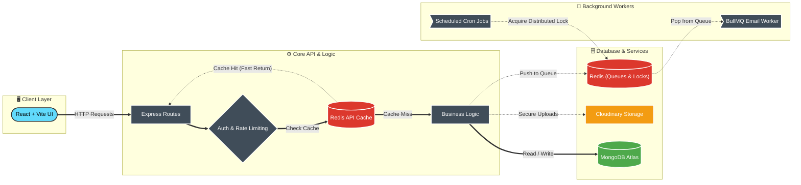

# SkillBridge

**Bridging talent and opportunity in one job portal.**

SkillBridge is a full-stack job portal built for candidates and recruiters to connect, apply, manage applications, and track opportunities with a highly optimized, scalable MERN stack experience.

## 🚀 Short Description

SkillBridge enables job seekers to browse live external jobs, apply with resumes, manage their profile, and track application history. Recruiters can post jobs, review applicants, and manage hiring workflows from a dedicated dashboard. 

The platform is designed with a premium frontend UI and heavily optimized backend architecture designed for scale (Redis Caching, Distributed Cron Locks, BullMQ Email Queues, and MongoDB Indexing).

---

## 🏗 System Architecture & Workflow



---

## 🧰 Tech Stack

- 
- 
- 
- 
-  (Caching, Locks, Queues)
-  (Async Email Queues)
-  (Google OAuth)
-  (Secure Resume Delivery)

---

## ⭐ Key Features

### 🔒 Security & Scaling
- **Redis-Backed Rate Limiting:** Brute-force protection on all auth routes.
- **API Caching:** High-traffic endpoints (`GET /api/jobs`) are cached in Redis with instant invalidation upon mutations.
- **Distributed Cron Locks:** Background jobs utilize Redis `SET NX EX` to prevent duplicate executions across horizontal deployments.
- **Asynchronous Email Queues:** Emails are offloaded to BullMQ background workers to prevent blocking HTTP request threads.
- **Time-Expiring Signed URLs:** Sensitive candidate resumes are served via Cloudinary authenticated, expiring URLs rather than public static links.

### 👤 Candidate Features
- Browse and search live external jobs.
- Apply directly with uploaded resumes.
- View application history and status.
- Edit candidate profile and skills.

### 🏢 Recruiter Features
- Create and manage job postings.
- Review and shortlist applicants.
- View individual applicant profiles.
- Separate recruiter dashboard and analytics.

---

## ⚙️ Setup & Installation

### 1. Clone the repo

```bash
git clone https://github.com/Chinmay0608/job-portal-system.git
cd job-portal-system
```

### 2. Install dependencies

```bash
cd backend
npm install

cd ../frontend
npm install
```

### 3. Environment variables

Create `.env` files in both `backend/` and `frontend/` using the example files.

#### Backend `.env`

| Key | Description |
| --- | --- |
| `PORT` | Port for backend server (e.g. `5000`) |
| `MONGO_URI` | MongoDB connection string |
| `REDIS_URL` | Redis connection URL |
| `JWT_SECRET` | Secret for signing JWT tokens |
| `JWT_EXPIRE` | JWT expiration (e.g. `7d`) |
| `CLOUDINARY_CLOUD_NAME` | Cloudinary cloud name |
| `CLOUDINARY_API_KEY` | Cloudinary API key |
| `CLOUDINARY_API_SECRET` | Cloudinary API secret |
| `EMAIL_USER` | SMTP email user for password reset |
| `EMAIL_PASS` | SMTP email password |

#### Frontend `.env`

| Key | Description |
| --- | --- |
| `VITE_API_BASE_URL` | Backend API base URL |
| `VITE_FIREBASE_API_KEY` | Firebase API Key |

### 4. Run development servers

#### Backend

```bash
cd backend
npm run dev
```

#### Frontend

```bash
cd frontend
npm run dev
```

## 🤝 Contributing

Contributions are welcome! Please open issues or pull requests to help improve SkillBridge.

## 📄 License

This project is licensed under the MIT License.
