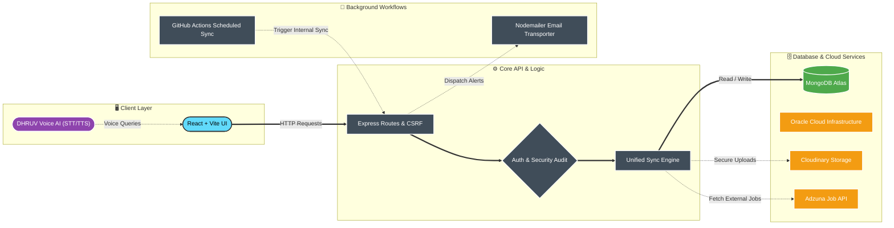

# SkillBridge 🚀

**Bridging talent and opportunity in one intelligent job portal.**

SkillBridge is a modern full-stack job portal built for candidates, recruiters, and administrators to connect, apply, manage applications, and aggregate global career opportunities. Powered by a high-performance MERN architecture, AI-assisted career coaching, automated job aggregation, and robust security middleware.

---

## 🌟 Live Demo & Preview

- **Web App**: [https://job-portal-system-alpha.vercel.app](https://job-portal-system-alpha.vercel.app)
- **Backend API**: Hosted on Oracle Cloud Infrastructure (OCI) with automated scheduled job sync crons and MongoDB Atlas.

---

## 🚀 Key Highlights

- 🤖 **DHRUV AI Assistant**: Voice-enabled AI assistant supporting Speech-to-Text (STT) and Text-to-Speech (TTS) voice readback for interactive career guidance, resume suggestions, and job matching.
- 🔄 **Unified Job Aggregation Sync**: Automated job aggregator engine (`sync.service.js`) fetching live job postings via Adzuna API with intelligent deduplication, stack-match scoring, and scheduled background sync.
- 🔒 **Robust Security Middleware**: Strict CSRF protection middleware, security audit logging, signed Cloudinary resume delivery, and strict CORS policies.
- 🎨 **Modern Responsive UI**: Clean Tailwind CSS design system with custom interactive job drawers, status badges, responsive advisory modals, and minimalist cookie consent management.

---

## 🏗 System Architecture & Workflow


```mermaid
graph LR
    %% Custom Styles
    classDef client fill:#61DAFB,stroke:#333,stroke-width:2px,color:#000
    classDef api fill:#404d59,stroke:#fff,stroke-width:2px,color:#fff
    classDef mongo fill:#4ea94b,stroke:#fff,stroke-width:2px,color:#fff
    classDef external fill:#f39c12,stroke:#fff,stroke-width:2px,color:#fff
    classDef ai fill:#8e44ad,stroke:#fff,stroke-width:2px,color:#fff

    %% Client Layer
    subgraph Frontend ["🖥️ Client Layer"]
        UI(["React + Vite UI"]):::client
        VoiceAI(["DHRUV Voice AI (STT/TTS)"]):::ai
    end

    %% API Layer
    subgraph Backend ["⚙️ Core API & Logic"]
        Router["Express Routes & CSRF"]:::api
        Auth{"Auth & Security Audit"}:::api
        SyncEngine["Unified Sync Engine"]:::api
    end

    %% Background Jobs & Actions
    subgraph Jobs ["🔄 Background Workflows"]
        GHActions["GitHub Actions Scheduled Sync"]:::api
        EmailService["Nodemailer Email Transporter"]:::api
    end

    %% Infrastructure & Data Layer
    subgraph Infrastructure ["🗄️ Database & Cloud Services"]
        MongoDB[("MongoDB Atlas")]:::mongo
        OCI["Oracle Cloud Infrastructure"]:::external
        Cloudinary["Cloudinary Storage"]:::external
        AdzunaAPI["Adzuna Job API"]:::external
    end

    %% Flow Connections
    UI ==>|"HTTP Requests"| Router
    VoiceAI -.->|"Voice Queries"| UI
    Router ==> Auth
    Auth ==> SyncEngine
    
    SyncEngine ==>|"Read / Write"| MongoDB
    SyncEngine -.->|"Secure Uploads"| Cloudinary
    SyncEngine -.->|"Fetch External Jobs"| AdzunaAPI
    
    GHActions -.->|"Trigger Internal Sync"| Router
    Router -.->|"Dispatch Alerts"| EmailService
```

---

## 🧰 Tech Stack

| Category | Technology |
| --- | --- |
| **Frontend** | React 19, Vite, Tailwind CSS, Lucide React, React Router v7, Axios, Web Speech API |
| **Backend** | Node.js, Express.js (v5), Mongoose, JWT Authentication |
| **Database & Infrastructure** | MongoDB Atlas, Oracle Cloud Infrastructure (OCI), Vercel |
| **AI Integration** | DHRUV Voice Assistant (STT / TTS Readback, Conversational AI) |
| **Security & Email** | CSRF Middleware, Security Audit Logging, Nodemailer (STARTTLS), Cloudinary (Signed Resumes), Firebase Admin (Google OAuth) |
| **Testing & CI** | Jest, ESLint, GitHub Actions CI/CD Pipeline (Scheduled Job Sync) |

---

## ⭐ Key Features

### 🔒 Security & Performance Engineering
- **CSRF Protection Middleware**: Custom header and Bearer token validation across all state-changing API endpoints (`POST`, `PUT`, `DELETE`).
- **Security Audit Logging**: Logs request origins, user agents, and sensitive administrative actions.
- **Time-Expiring Signed Resume Access**: Sensitive candidate resume documents are served via Cloudinary authenticated signed URLs.
- **STARTTLS Resilient Email Transport**: Email service using port 587 STARTTLS with connection error fallback for reliable delivery.
- **Locale-Aware Formatting**: Normalizes salary ranges explicitly with `en-IN` locale formatting (`₹1,00,000 - ₹1,50,000`).

### 🤖 DHRUV AI Assistant & Candidate Portal
- **DHRUV Voice Coach**: Interactive AI drawer for job recommendations, interview prep, and career guidance.
- **Live Job Search**: Search and filter live aggregated jobs across technical, management, design, and business domains.
- **Smart Job Description Formatter**: Multi-strategy parser handling Markdown formatting, header stripping, section splitting, and bullet rendering.
- **Profile & Resume Tracking**: Single-click application submission with instant status history tracking.

### 🏢 Recruiter & Admin Management
- **Job Posting Management**: Create, edit, feature, and manage job requisitions.
- **Applicant Pipeline**: Review candidates, inspect resumes, shortlist or decline applicants, and communicate with job seekers.
- **Admin System Dashboard**: System management metrics covering platform applications, active job listings, user feedback tickets, and security logs.

---

## ⚙️ Setup & Installation

### 1. Clone the Repository

```bash
git clone https://github.com/Chinmay0608/job-portal-system.git
cd job-portal-system
```

### 2. Install Dependencies

```bash
# Install backend packages
cd backend
npm install

# Install frontend packages
cd ../frontend
npm install
```

### 3. Environment Variables Configuration

Create a `.env` file in both `backend/` and `frontend/` directories:

#### Backend `.env`

```env
PORT=5000
NODE_ENV=production
MONGO_URI=mongodb+srv://<user>:<password>@cluster.mongodb.net/job-portal
JWT_SECRET=your_jwt_secret_key
SYNC_SECRET_KEY=your_sync_secret_key

# Cloudinary Storage
CLOUDINARY_CLOUD_NAME=your_cloud_name
CLOUDINARY_API_KEY=your_api_key
CLOUDINARY_API_SECRET=your_api_secret

# Email Services
EMAIL_USER=SkillBridge684@gmail.com
EMAIL_PASS=your_email_app_password

# Job Provider APIs
ADZUNA_APP_ID=your_adzuna_app_id
ADZUNA_APP_KEY=your_adzuna_app_key

# Allowed Origins
FRONTEND_URL=https://job-portal-system-alpha.vercel.app
ALLOWED_ORIGINS=https://job-portal-system-alpha.vercel.app
```

#### Frontend `.env`

```env
VITE_API_BASE_URL=http://localhost:5000/api
VITE_FIREBASE_API_KEY=your_firebase_api_key
```

---

## 🧪 Running Tests & Quality Gates

### Backend Unit Tests (Jest)

```bash
cd backend
npm test
```

Runs 9 test suites (56 unit tests covering CSRF middleware, email transport error handling, envUtils, SDE core components, Adzuna normalization, sync controllers, and route handlers).

### Frontend Quality Gate (ESLint & Vite Build)

```bash
cd frontend
npm run lint
npm run build
```

---

## 🤝 Contact & Support

For security inquiries or platform support, reach out to the official team:
📧 **Official Contact**: [SkillBridge684@gmail.com](mailto:SkillBridge684@gmail.com)

---

## 📄 License

This project is licensed under the [MIT License](LICENSE).
